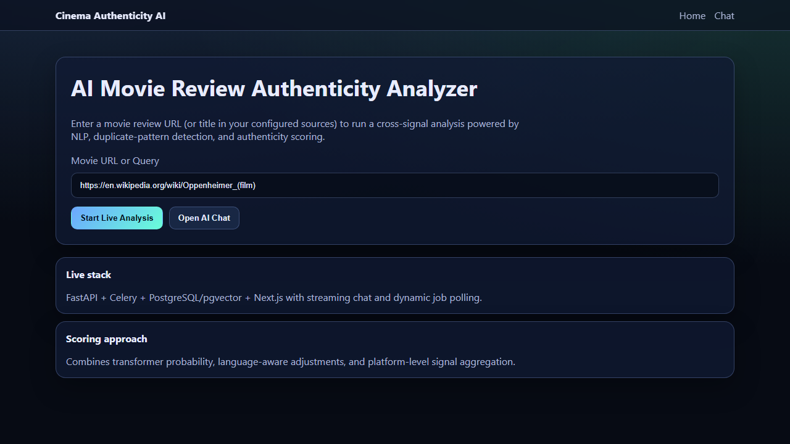
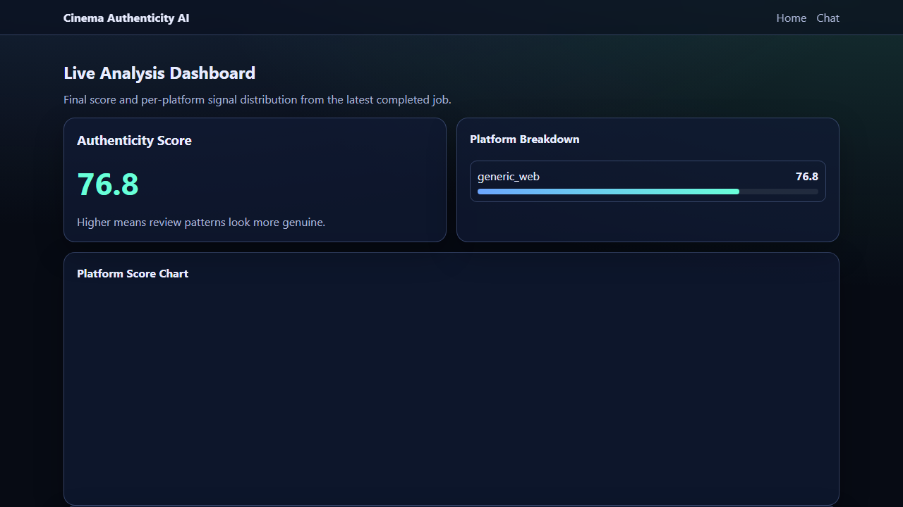
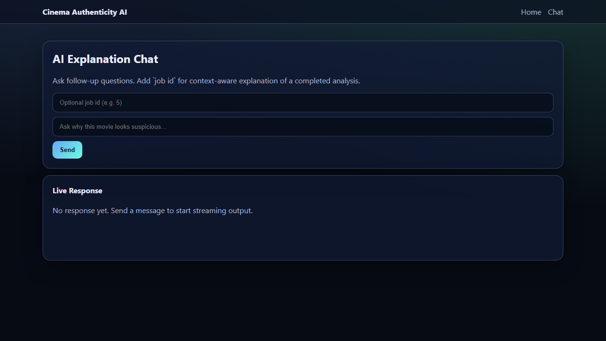

<div align="center">

# 🎬 Cinema Review Authenticity Platform

### AI + ML System for Detecting Real vs Fake Movie Reviews

[](https://www.python.org/)
[](https://fastapi.tiangolo.com/)
[](https://nextjs.org/)
[](https://www.docker.com/)
[](https://github.com/pgvector/pgvector)
[](LICENSE)

<br/>

> **Cinema Review Authenticity Platform** is a production-oriented full-stack system that ingests movie reviews from multiple sources, scores suspicious review behavior with ML + heuristics, and returns an explainable authenticity score through API, dashboard, and chat.

<br/>

  

</div>

---

## 📋 Table of Contents

- [Overview](#-overview)
- [Application Preview](#-application-preview)
- [Features](#-features)
- [Architecture](#-architecture)
- [Tech Stack](#-tech-stack)
- [Project Structure](#-project-structure)
- [Installation](#-installation)
- [Usage](#-usage)
- [API Reference](#-api-reference)
- [Configuration](#-configuration)
- [Testing](#-testing)
- [Legal and Security Notes](#-legal-and-security-notes)

---

## 🧠 Overview

This project helps answer critical authenticity questions for movie review ecosystems:

- Are review patterns organic or coordinated?
- Are multiple platforms showing suspiciously similar language?
- Are rating and sentiment mismatched at scale?
- Which platform contributes most to authenticity risk?

The system combines:

- Transformer-based text scoring
- Multilingual support path for Hindi/Hinglish scenarios
- Duplicate/template and burstiness heuristics
- Cross-platform aggregation and explanation

---

## 💻 Application Preview
<br/>


<br/>
<br/>

<br/>
<br/>

<br/>

---

## ✨ Features

| Feature | Description |
|---|---|
| 🔎 **Cross-Source Ingestion** | Ingests review-like content from API sources and user-provided URL pages |
| 🧠 **ML Authenticity Scoring** | Transformer-based probability scoring pipeline for suspicious/fake signals |
| 🌍 **Multilingual Handling** | Language detection and adjustment path for non-English review text |
| 🧬 **Heuristic Signals** | Duplicate rate, template repetition, burstiness, and sentiment-rating mismatch |
| 📊 **Explainable Final Score** | Platform-level scores aggregated into `AuthenticityScore (0-100)` with summary |
| ⚙️ **Async Processing** | Celery + Redis background jobs with status polling via API |
| 💬 **Chat Interface** | SSE streaming chat endpoint to explain completed analysis results |
| 🐳 **Production Deployable** | Dockerized services, CI pipeline, and deployment configs included |

---

## 🏗️ Architecture

```text
┌──────────────────────────────────────────────────────────────┐
│                    Next.js Frontend                          │
│      Home • Analyze Dashboard • Streaming Chat               │
└─────────────────┬────────────────────────────────────────────┘
                  │ HTTP/SSE
┌─────────────────▼────────────────────────────────────────────┐
│                      FastAPI Backend                         │
│  /api/analyze      create + fetch analysis jobs              │
│  /api/chat         stream explanations from analysis         │
│  /health           readiness                                 │
└─────────────────┬────────────────────────────────────────────┘
                  │ enqueue
         ┌────────▼────────┐
         │ Celery + Redis  │
         │ async workers   │
         └────────┬────────┘
                  │
┌─────────────────▼────────────────────────────────────────────┐
│                   Analysis Pipeline                          │
│  Scrapers/APIs -> ML + Heuristics -> Aggregator -> Report    │
└─────────────────┬────────────────────────────────────────────┘
                  │
         ┌────────▼────────┐
         │ PostgreSQL      │
         │ + pgvector      │
         └─────────────────┘
```

---

## 🛠️ Tech Stack

| Layer | Technology |
|---|---|
| **Frontend** | Next.js 14, TypeScript, React |
| **Backend** | FastAPI, Pydantic, SQLAlchemy, Alembic |
| **Async Jobs** | Celery, Redis |
| **Database** | PostgreSQL + pgvector |
| **ML/NLP** | Transformers, Sentence-Transformers, scikit-learn |
| **Scraping/API** | httpx, selectolax, Playwright, asyncpraw |
| **Observability** | Prometheus FastAPI instrumentator, structlog, Sentry SDK |
| **DevOps** | Docker, Docker Compose, GitHub Actions |

---

## 📁 Project Structure

```text
cinema-review/
├── backend/
│   ├── app/
│   │   ├── main.py
│   │   ├── api/routes/
│   │   ├── agents/
│   │   ├── core/
│   │   ├── db/
│   │   ├── ml/
│   │   ├── scrapers/
│   │   ├── services/
│   │   └── tasks/
│   ├── alembic/
│   ├── ml_training/
│   ├── tests/
│   ├── requirements.txt
│   └── Dockerfile
├── frontend/
│   ├── app/
│   ├── components/
│   ├── lib/
│   ├── package.json
│   └── Dockerfile
├── docs/screenshots/
├── docker-compose.yml
├── docker-compose.prod.yml
└── README.md
```

---

## 🚀 Installation

### Prerequisites

- Docker Desktop (recommended)
- Git

### Run with Docker (recommended)

```bash
copy .env.example .env
docker compose up --build -d
```

### Access

- Frontend: `http://localhost:3000`
- Backend API: `http://localhost:8000`
- OpenAPI docs: `http://localhost:8000/docs`
- Health: `http://localhost:8000/health`

### Run migrations

```bash
docker compose exec backend alembic upgrade head
```

---

## 💻 Usage

### 1) Submit an analysis job

```bash
curl -X POST "http://localhost:8000/api/analyze" ^
  -H "x-api-key: dev-key" ^
  -H "Content-Type: application/json" ^
  -d "{\"query\":\"https://en.wikipedia.org/wiki/Oppenheimer_(film)\"}"
```

### 2) Poll job status

```bash
curl "http://localhost:8000/api/analyze/<job_id>" -H "x-api-key: dev-key"
```

### 3) Use chat explanation

`POST /api/chat` with optional `job_id` for context-aware verdict explanations.

---

## 🔌 API Reference

| Method | Endpoint | Description |
|---|---|---|
| GET | `/health` | Service health check |
| POST | `/api/analyze` | Queue an authenticity analysis job |
| GET | `/api/analyze/{job_id}` | Fetch status/result for a job |
| POST | `/api/chat` | Streaming chat explanation (SSE) |
| GET | `/metrics` | Prometheus metrics endpoint |

---

## ⚙️ Configuration

Set values in `.env`:

```env
APP_NAME=Cinema Review Authenticity Platform
DATABASE_URL=postgresql+psycopg://postgres:postgres@db:5432/cinema_review
REDIS_URL=redis://redis:6379/0
CELERY_BROKER_URL=redis://redis:6379/1
CELERY_RESULT_BACKEND=redis://redis:6379/2
ENABLE_SCRAPED_SOURCES=true
TMDB_API_KEY=
OMDB_API_KEY=
REDDIT_CLIENT_ID=
REDDIT_CLIENT_SECRET=
OPENAI_API_KEY=
```

---

## 🧪 Testing

```bash
# Backend tests
cd backend
python -m pytest

# Frontend production build
cd ../frontend
npm run build
```

---

## 🔒 Legal and Security Notes

- Respect each source platform Terms of Service before enabling crawlers in production.
- Keep scraping feature flags disabled where policy prohibits automated extraction.
- Never commit API keys or production secrets.
- Rotate credentials and enforce stronger API key management before public deployment.

---

## 📜 License

This repository currently does not include a license file.
Add `LICENSE` (for example MIT) if you want open-source reuse terms.

---

<div align="center">

Built by [crastatelvin](https://github.com/crastatelvin)

⭐ Star this repository if it helped you.

</div>
